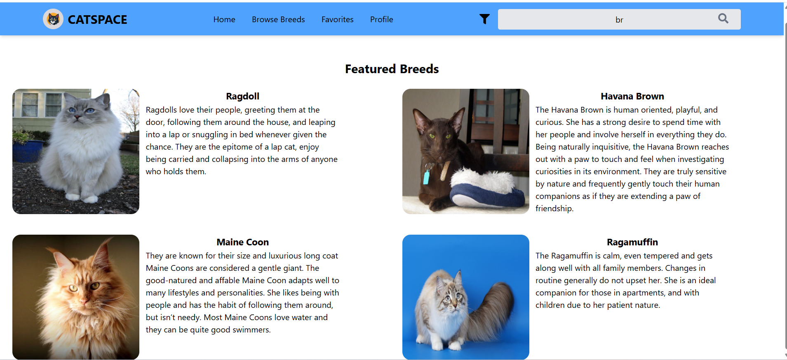
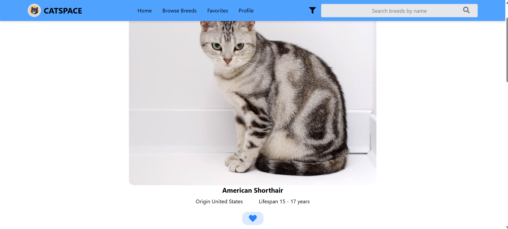
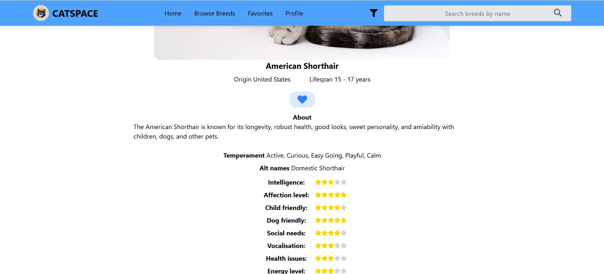
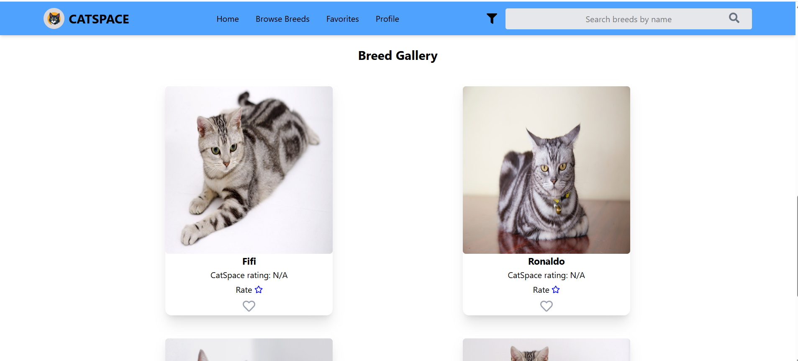
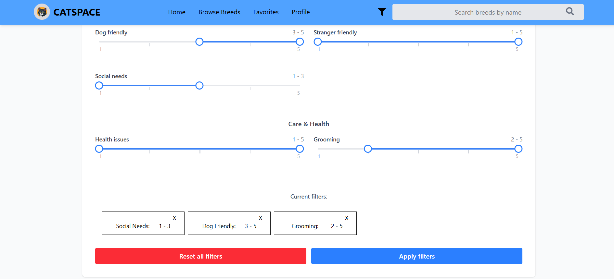

# 🐱 CatSpace - Full Stack Cat Directory

**CatSpace** is a comprehensive web application for cat lovers to explore breeds, manage favorites, and rate individual cats. Built with a **React (TypeScript)** frontend and a **Ruby on Rails** backend, it demonstrates complex data filtering, asynchronous processing, and advanced state management.

## 🚀 Live Demo
[Check out the live app here](https://your-demo-link.vercel.app) 
*(Note: Please allow ~30s for the initial load as the backend is hosted on a free tier).*

## 🛠 Tech Stack

* **Frontend:** React , TypeScript, Tailwind CSS, Zustand (State Management).
* **Backend:** Ruby on Rails (REST API) - Service-Oriented Architecture.
* **Database:** PostgreSQL.
* **Asynchronous Tasks:** Active Job (Background processing for Cloudinary image uploads).
* **Key Tools:** React Router, Axios, Lucide Icons.

## ✨ Key Features

* **Comprehensive Breed Explorer:** Browse a vast library of cat breeds with custom pagination and seamless UI transitions.
* **Dynamic Breed Profiles:** Detailed pages featuring lifespan, origin, temperament, and health attributes visualized through intuitive star ratings.
* **Advanced Search & Filtering:**
    * **Live Search:** Instant search by breed name with filtered results.
    * **Multi-attribute Filtering:** Advanced search engine using range sliders for specific traits like Intelligence, Grooming, Social Needs, and Dog Friendliness.
* **Interactive Rating System:** Rate individual cats (1-10) with real-time average score updates and persistent data.
* **Personalized Experience:** * One-click "Favorites" for both specific cats and entire breeds.
    * User dashboard to manage personal ratings and curated favorite lists.
* **Media Gallery:** Each breed profile includes a curated gallery showcasing breed variety through external API integration.

## 📸 Screenshots

| Home Page | Breed Profile | Advanced Filtering |
| :--- | :--- | :--- |
|  |  <br><br>  <br><br>  |  |

---

## ⚙️ Technical Highlights

### Backend (Ruby on Rails)
* **Service Object Pattern:** Business logic is decoupled from controllers into specialized services (e.g., `RatingService`), ensuring "Thin Controllers" and high maintainability.
* **Background Jobs:** Utilized `ActiveJob` for offloading image processing tasks to ensure non-blocking API performance.
* **Robust Error Handling:** Global rescue blocks with standardized JSON error responses and appropriate HTTP status codes.
* **Data Integrity:** Implemented `find_or_initialize_by` patterns to handle external API data synchronization efficiently.

### Frontend (React & TypeScript)
* **Type Safety:** Full TypeScript implementation ensuring robust props, API response handling, and state models.
* **State Management & Caching:** Leveraged **Zustand** to manage global UI state and implement a custom client-side caching layer for breed data to minimize redundant network requests.
* **Responsive UI:** Mobile-first approach using Tailwind CSS for a seamless experience across all devices.

---

## 🧠 Lessons Learned & Roadmap

* **Performance Optimization:** Learned the importance of database indexing for frequent multi-attribute filtering.
* **Future Improvements:**
    * [ ] **Testing:** Implement RSpec for backend services and Vitest for React components.
    * [ ] **Server-state Migration:** Transition from custom Zustand caching to **TanStack Query** for advanced synchronization.
    * [ ] **Dockerization:** Containerize the application for easier deployment and environment consistency.

---

## ⚙️ Installation & Setup

1.  **Clone the repository**
    ```bash
    git clone [https://github.com/yourusername/catspace.git](https://github.com/yourusername/catspace.git)
    ```

2.  **Backend Setup**
    ```bash
    cd backend
    bundle install
    rails db:setup
    rails s
    ```

3.  **Frontend Setup**
    ```bash
    cd frontend
    npm install
    npm run dev
    ```
